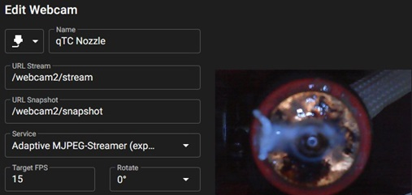

# kTAMV - Klipper Tool Alignment (using) Machine Vision

This allows X and Y allignment betwween multiple tools on a 3D printer using a camera that points up towards the nozzle from inside Klipper.

It has one part that runs as a part of Klipper, adding the necesary commands and integration, and one part that does all the io and cpu intensive calculations as a webserver, localy or on any computer for true multithreading. 

It adds the following commands to klipper:

- `KTAMV_CALIB_CAMERA`, moves the toolhead around the current position for camera-movement data
- `KTAMV_FIND_NOZZLE_CENTER`, detects the nozzle in the current nozzle cam image and attempts to move it to the center of the image.
- `KTAMV_SET_ORIGIN`, sets the current X,Y position as origin to use for calibrating from.
- `KTAMV_GET_OFFSET`, Get the offset from the current X,Y position to the origin X,Y position. Prints it to console.
- `KTAMV_MOVE_TO_ORIGIN`, moves the toolhead to the configured center position origin as set with KTAMV_SET_ORIGIN
- `KTAMV_SIMPLE_NOZZLE_POSITION`, checks if a nozzle is detected in the current nozzle cam image and reports whether it is found. The printer will not move.
- `KTAMV_TEST`, debug command to check if the script works and OpenCV versions

!!! !!! !!! !!! !!!
This is alpha software and only meant for advanced users!
Please only use while supervising your printer,
may produce unexpected results,
be ready to hit 'emergency stop' at any time!
!!! !!! !!! !!! !!!

## How to install

Connect to your klipper machine using SSH, run these command

```bash
cd ~/ && git clone -b dev https://github.com/TypQxQ/kTAMV.git && bash ~/kTAMV/install.sh
```

This will clone the repository and execute the install script.
The install script will update the system, install the requrements system wide, link the Klipper extensions, add configuration to printer.cfg, add moonraker automatic update, install the server a system.d process and add it to Moonraker to be able to start and stop it within your preffered web interface.

## Configuration
The installation script will add a section to printer.cfg that looks like the following:
```yml
[ktamv]
nozzle_cam_url: http://localhost/webcam/stream
server_url: http://localhost:8085
move_speed: 3000
send_frame_to_cloud: true
```
If your nozzle webcamera is on another stream, change that. You can find out what the stream is called in the Mainsail camera configuration. For example, here this is webcam2, so my configuration would be `nozzle_cam_url: http://localhost/webcam2/stream`.




-------
```
[cv_toolhead_calibration]
nozzle_cam_url: http://localhost:8081?action=stream
camera_position: 75,75 # X,Y mm values of the T0 toolhead visible in the center of the nozzle camera
```

## First time running after install

1. Run the `CV_CENTER_TOOLHEAD` command to center the toolhead
2. Connect and open the web page to view the nozzle cam
3. Position the camera so that the nozzle is roughly in the center of the image
4. Run the `CV_SIMPLE_NOZZLE_POSITION` command, this should return your nozzle position in the image
5. If everything works, you can run `CV_CALIB_OFFSET` 

## FAQ
- Do I need to install the server?
  - Yes.
- Why not run everything inside Klipper?
  - Using a server component moves all io and cpu intensiv work to another cpu core, preventing Klipper to timeout. Also this moves all requirements to the server, not needing to install anything in the Klipper enviroment.
- Why install the requirements to the entire server and not using a venv and pip to install localy?
  - Installing OpenCV, the component doing the Computer Vision magic, takes 2-3 hours to install in a venv because it needs to be compiled in place. Installing it systems wide uses the Raspberry Pi precompiled versions that are tested and maintained by the developers of the OS.
- Can I run the server on another computer?
  - Yes. It runs fine on Windows too.
- Can I run the server in a Docker component?
  - I can't see why not.
- Will anything be sent out from my computer?
  - Only if you allow it with the send_frame_to_cloud option. It will then only send out the unprocessed image, coordinates here it found the middle of the nozzle and what algorithm was used. This is sent to a database and is anonymous.
- Why collect the data?
  - To try to train an AI to find the nozzle. I don't know if and when I can do it but the more data I recieve, the more precise an AI can be with diffrent types of nozzles, heights and lightning setups.
- Why did you build this?
  - I was too lazy too install and run TAMV in a desktop enviroment so I spent weeks on this instead.
- Why do I have to enter the ip adress of the 

## How it works
This project consists of two parts: a Klipper plugin and a web server based on Flask and Waitress. The Klipper plugin runs within the environment managed by Klipper and does not require any additional components. The web server, on the other hand, depends on various specific components for image recognition, mathematics, statistics and web serving. This project is truly multithreaded because the web server operates in its own Python instance and can even run on a different machine. This is unlike only running in Klipper, which is not truly multithreaded and has to prioritize real-time interaction with the printer mainboards.

The camera calibration performs small movements around the initial position to keep the nozzle centered and prevent the nozzle opening from becoming oval-shaped. It will try to find the nozzle in each position and calculate the distance in pixels between the two, already knowing the requested physical distance on the printer. It uses ten positions and skips the ones where the nozzle is not detected. It then filters out the values that deviate more than 20% from the average, removing false readings and using only true values. It finallycalculates a matrix it can use to map the distance between a point and the center on the image and the real space coordinates.

When the server needs to find the center of the nozzle it will first fetch a frame from the webcamera, it is the only time it accesses the webcam feed. Then it will resize the image to 640x480 pixels. After this it will try to find a circle that would match the nozzle opening by going trough five diffrent detector and image preprocessor combinations. If it finds multiple circles, it will then use the one closest to the center of the image. It will repeat the above until it has found the same middlepoint 3 consecutive times with a tolerance of one pixel, or it times out, default 20s.


## Special thanks
 - This extension uses much of the logic in TAMV. TAMV uses a GUI inside the Desktop enviroment to align toolheads using computer vision. For more information see: https://github.com/HaythamB/TAMV
- CVToolheadCalibration that is also a Klipper plugin inspired by TAMV but for IDEX printers. For more information see: https://github.com/cawmit/klipper_cv_toolhead_calibration
- The user psyvision from the Jubilee discord, who tested early versions of the extension and gave very valuable feedback